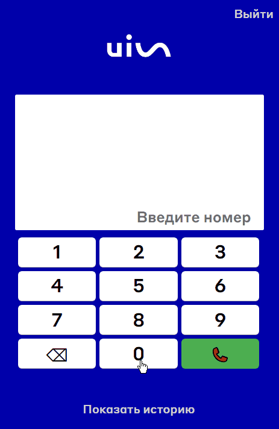

## Reactive Phone

**Reactive Phone** - представляет собой расширение для браузера Google Chrome, позволяющее делать звонки с помощью протокола Sip.

  

  Скачать расширение: <a href="https://github.com/nick6850/react-sip-extension/raw/main/dist.crx">ссылка</a>. Для установки откройте страницу расширений в режиме разработчика в Google Chrome (chrome://extensions/), нажмите "Загрузить распакованное расширение" и выберите скачанную папку "dist".

## Технологический стек

  
  
  
  
  
  

В приложении используется **Vite** для сборки, **JsSIP** для осуществления звонков, **MobX** для управления состоянием, **SASS** для удобного написания стилей, **Ant Design (AntD)** в качестве основной библиотеки компонентов пользовательского интерфейса.

## Модель ветвления

В процессе работы над приложением я придерживался модели ветвления **GitFlow**:

  

## Функционал

### 1. Регистрация

Описание: Для **регистрации** на сервере пользователю необходимо ввести данные, такие как сервер, логин, пароль и порт (опционально). Форма регистрации реализована с помощью компонента **Form** библиотеки **AntD**.

  

Реализация: Введенные данные отправляются в глобальное хранилище **MobX 'UserStore'** с помощью метода **setUserDetails**. Получив данные, хранилище проверяет их на соответствие формату, приводит к необходимому стандарту и после использует их для установки соединения с помощью метода **establishSIPConnection** и библиотеки **JsSIP**. В случае успешной установки соединения **UserStore** сохраняет данные о пользователе в **localStorage**.

### 2. Выполнение звонков

Описание: После регистрации пользователь может **звонить** другим абонентам. Для этого ему представлена виртуальная клавиатура и дисплей.

  

Реализация: Введя номер и нажав кнопку позвонить создается новая сессия **SIP** с помощью функции **makeCall** (см. файл SIPService.js). Сессия звонка сохраняется в **MobX хранилище 'CallStore'** и доступна для управления (например, завершения) в любом компоненте приложения.

### 3. Отображение информации о звонке

Описание: Во время разговора пользователь видит текущую продолжительность вызова, а также номер абонента.

  

Реализация: Все данные текущего вызова такие как время его начала, статус, id находятся в **MobX хранилище 'CallStore'**. Во время разговора эти данные используются компонентом **CallDetails** для отображения интерфейса.

Данные из CallStore используются для отображения текущего **статуса вызова** (вызов, в процессе, завершился, не удалось и т.д.).

  

### 4. Приём входящих звонков

Описание: Зарегистрированные пользователи могут не только звонить другим абонентам, но и **принимать входящие звонки**. Пользователь видит данные о звонящем (его номер телефона) и может взять или отклонить вызов.

  

Реализация: Когда происходит входящий звонок, пользователь об этом уведомлен с помощью компонента **Modal** библиотеки **AntD**, а также звукового сигнала.

### 5. История звонков

Описание: Расширение сохраняет **историю вызовов**, позволяя пользователю просматривать информацию о сделанных звонках.

  

Реализация: При завершении каждого разговора, данные о вызове сохраняются в массив **callHistory** (находится в **CallStore**), а также в **localStorage**. Эти данные используются компонентом **CallHistory** для отображения соответствующего интерфейса. При выходе из профиля данные удаляются.

## Запуск проекта

### Клонирование репозитория

Сначала клонируйте репозиторий на ваше локальное устройство с помощью следующей команды Git:

<code>git clone https://github.com/nick6850/react-sip-extension</code>

### Переход в папку проекта

После клонирования репозитория перейдите в папку проекта с помощью команды:

<code>cd react-sip-extension</code>

### Установка зависимостей проекта

Установите необходимые зависимости проекта, выполнив следующую команду:

<code>npm install</code>

### Сборка проекта

Выполните команду сборки проекта:

<code>npm run build</code>

После выполнения этой команды в папке проекта появится папка `dist`, которую можно использовать для установки расширения в браузере.

### Установка расширения в браузер

1. Откройте страницу расширений в Google Chrome (chrome://extensions/).
2. Включите режим разработчика, переключив соответствующую кнопку в правом верхнем углу.
3. Нажмите кнопку "Загрузить распакованное расширение" и выберите папку `dist` из вашего локального проекта.
